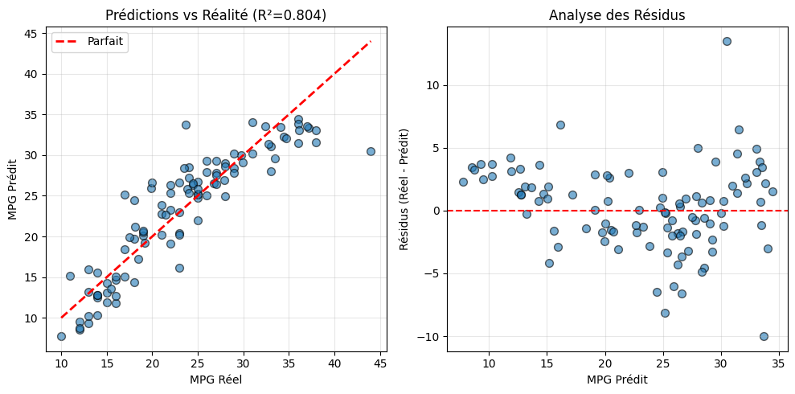

# 🚗 Auto MPG Prediction - Multiple Linear Regression

Predicting vehicle fuel efficiency (MPG) using multiple linear regression with comprehensive feature engineering and model interpretation.



##  Overview
This project implements a **multiple linear regression** model to predict a vehicle's miles per gallon (MPG) based on its characteristics. The dataset includes various vehicle features such as horsepower, weight, cylinders, and manufacturing origin.

##  Key Features
- **Complete ML pipeline** with preprocessing and modeling
- **Handles mixed data types** (numerical + categorical)
- **Comprehensive evaluation** with multiple metrics
- **Model interpretation** with feature importance analysis
- **Visualization suite** for data exploration and results

##  Dataset: Auto MPG
**Source**: UCI Machine Learning Repository  
**Samples**: 398 vehicles  
**Features**: 8 predictors + target

### Features Description:
| Feature | Type | Description |
|---------|------|-------------|
| `mpg` | Target | Miles per gallon (fuel efficiency) |
| `cylinders` | Numerical | Number of cylinders (3-8) |
| `displacement` | Numerical | Engine displacement (cu. inches) |
| `horsepower` | Numerical | Engine horsepower |
| `weight` | Numerical | Vehicle weight (lbs) |
| `acceleration` | Numerical | Time to accelerate 0-60 mph (seconds) |
| `model_year` | Numerical | Model year (70-82) |
| `origin` | Categorical | Manufacturing region (1=USA, 2=Europe, 3=Japan) |
| `car_name` | Categorical | Vehicle make and model |


##  Installation & Usage

### Run the Analysis
python auto-regression.py

### Prerequisites
```bash
pip install -r requirements.txt
