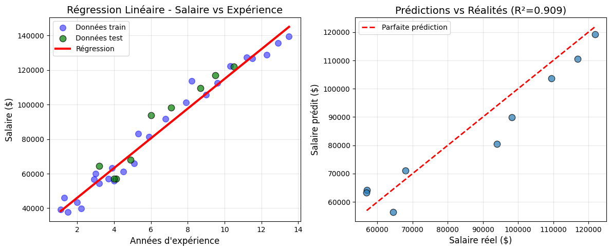

# Salary Prediction - Linear Regression

Predicting salaries based on years of experience using **Ordinary Least Squares (OLS)** linear regression.



## Overview
This project demonstrates a complete machine learning pipeline for predicting salaries based on years of experience. It implements the **method of least squares** (normal equation) through scikit-learn's `LinearRegression` class.

## Key Features
- **Complete ML pipeline**: Data loading → EDA → Preprocessing → Training → Evaluation
- **Model interpretation**: Clear equation and coefficient analysis
- **Comprehensive evaluation**: R², MSE, RMSE, MAE metrics
- **Visualization**: Multiple plots for better understanding
- **Overfit detection**: Comparison of train/test performance

## Dataset
- **Source**: Synthetic salary dataset
- **Features**:
  - `YearsExperience`: Years of work experience (1-13.5 years)
  - `Salary`: Annual salary in USD (30K-139.5K)
- **Samples**: 35 data points
- **Format**: CSV

## Installation & Usage

### Prerequisites
```bash
pip install pandas numpy matplotlib seaborn scikit-learn

### RUN Analysis
python salary_regression.py